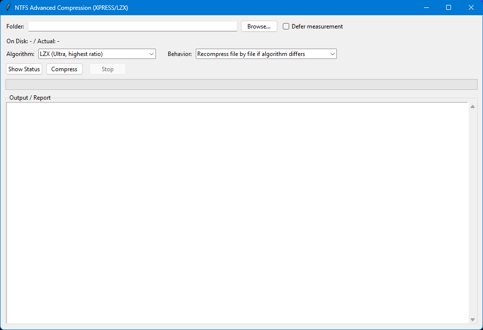

# NTFS Advanced Compression Tool

A modern GUI application for Windows that enables advanced NTFS compression using XPRESS and LZX algorithms. This tool provides an easy-to-use interface for compressing files and folders with Windows' built-in advanced compression algorithms, offering better compression ratios than the traditional NTFS compression.


[](https://buymeacoffee.com/bariselcii)

## Features

- 🗜️ **Multiple Compression Algorithms**
  - XPRESS4K (Fast, low compression)
  - XPRESS8K (Medium, balanced)
  - XPRESS16K (Slow, higher compression)
  - LZX (Ultra, highest compression ratio)

- 📊 **Detailed Status Reports**
  - View compression status of all files
  - See which algorithm is currently applied
  - Display actual size vs. size on disk
  - Calculate compression savings percentage

- 🎯 **Smart Compression Options**
  - Skip already compressed files
  - Recompress files if algorithm differs
  - Defer initial measurement for faster startup

- 💻 **User-Friendly Interface**
  - Modern Tkinter GUI
  - Real-time progress tracking
  - Live log output
  - Stop operation at any time

- 📈 **Comprehensive Reporting**
  - Before and after disk space comparison
  - File-by-file compression results
  - Easy-to-read formatted output

## Requirements

- **Operating System**: Windows 10/11 (with NTFS filesystem)
- **Python**: 3.6 or higher
- **Privileges**: Administrator rights (required for compression operations)

## Installation

1. **Download the latest release**
   - Go to [Releases](https://github.com/b-elci/ntfs-compactor/releases)
   - Download `NTFS-Compactor-v1.0.1-Windows.zip`
   - Extract and run `NTFS-Compactor-v1.0.1.exe` as administrator
   - No Python installation needed!

2. **Or clone the repository** (for Python users)
   ```bash
   git clone https://github.com/b-elci/ntfs-compactor.git
   cd ntfs-compactor
   ```

3. **No external dependencies required!**
   The application uses only Python standard library modules.

4. **Run the application**
   ```bash
   python compactor.py
   ```

   Or run as administrator (recommended):
   - Right-click on `compactor.py`
   - Select "Run as administrator"

## Usage

### Basic Usage

1. **Select a Folder**
   - Click the "Browse..." button
   - Choose the folder you want to compress
   - The tool will measure the current disk usage (unless "Defer measurement" is checked)

2. **Choose Compression Algorithm**
   - **XPRESS4K**: Fastest compression, lowest ratio (~5-15% savings)
   - **XPRESS8K**: Balanced performance and compression (~10-25% savings)
   - **XPRESS16K**: Slower compression, better ratio (~15-35% savings)
   - **LZX**: Best compression ratio, slowest (~20-50% savings)

3. **Select Behavior**
   - **Skip**: Don't recompress files that are already compressed
   - **Recompress if different**: Recompress files that use a different algorithm

4. **Operations**
   - **Show Status**: Scan and display current compression status without making changes
   - **Compress**: Apply selected compression algorithm to all files in folder
   - **Stop**: Cancel the current operation

### Advanced Options

- **Defer measurement**: Check this option to skip the initial folder size measurement, which can be slow for large folders. The measurement will be performed when you start compression.

### Understanding the Output

The status report shows:
```
Status       | Algorithm    | Size → On Disk      | Savings % | File Path
-------------|--------------|---------------------|-----------|----------
Compressed   | LZX          | 10.50 MB → 5.25 MB  | 50%       | C:\path\to\file.dat
Uncompressed | -            | 2.00 MB → 2.00 MB   | 0%        | C:\path\to\file2.txt
```

## How It Works

This tool wraps the Windows `compact.exe` command-line utility with a modern GUI:

1. **Status Checking**: Queries file compression status using `compact /q`
2. **Compression**: Applies compression using `compact /c /exe:algorithm`
3. **Size Measurement**: Uses Windows API `GetCompressedFileSizeW` for accurate disk space reporting

### Compression Algorithms

- **XPRESS**: Microsoft's fast compression algorithm with multiple block sizes
- **LZX**: Microsoft's high-ratio compression based on LZ77 and Huffman coding
- **LZNT1**: Legacy NTFS compression (detected but not applied by this tool)

## Screenshots



*The modern GUI interface showing compression options, progress tracking, and live output.*

## Important Notes

⚠️ **Warnings and Limitations**

1. **Windows Only**: This tool only works on Windows with NTFS file system
2. **Administrator Rights**: Required for applying compression
3. **File Access**: Files in use cannot be compressed
4. **Performance**: Compression is CPU-intensive and may take time for large folders
5. **Compatibility**: Compressed files remain fully compatible and accessible
6. **Decompression**: Files automatically decompress when copied to non-NTFS drives

## Best Practices

- 🎯 **Start Small**: Test on a small folder first to understand the behavior
- 💾 **Choose Wisely**: Use LZX for archival data, XPRESS8K for frequently accessed files
- ⏱️ **Be Patient**: Large folders can take considerable time to compress
- 🔄 **Backup First**: Although safe, always backup important data before compression
- 📊 **Monitor Results**: Use "Show Status" to verify compression results

## Troubleshooting

**Problem**: "Access Denied" errors
- **Solution**: Run as Administrator

**Problem**: Files not compressing
- **Solution**: Ensure files are not in use and the file system is NTFS

**Problem**: Slow performance
- **Solution**: Use faster algorithm (XPRESS4K) or enable "Defer measurement"

**Problem**: Compression not showing results
- **Solution**: Check that the drive supports NTFS compression

## Contributing

Contributions are welcome! Please feel free to submit a Pull Request. For major changes:

1. Fork the repository
2. Create your feature branch (`git checkout -b feature/AmazingFeature`)
3. Commit your changes (`git commit -m 'Add some AmazingFeature'`)
4. Push to the branch (`git push origin feature/AmazingFeature`)
5. Open a Pull Request

## License

This project is licensed under the MIT License - see the [LICENSE](LICENSE) file for details.

## Acknowledgments

- Built with Python's Tkinter for cross-version compatibility
- Uses Windows API for accurate size reporting
- Leverages Windows built-in `compact.exe` utility
- Icon: [Data compression icons created by Freepik - Flaticon](https://www.flaticon.com/free-icons/data-compression)

## Author

**Barış Elçi** ([b-elci](https://github.com/b-elci))

Created with ❤️ for the Windows power user community

## Support

If you encounter any issues or have questions:
- Open an issue on GitHub
- Check existing issues for solutions

## Support the Project

If you find this tool useful, consider supporting its development:

☕ **[Buy Me a Coffee](https://buymeacoffee.com/bariselcii)**

Your support helps maintain and improve this project!

---

**Note**: This tool provides a user-friendly interface to Windows' built-in compression features. It does not introduce any new compression algorithms or modify Windows system files.
